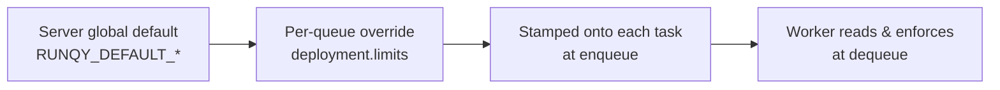

# Task Lifecycle: TTL, Timeouts & Retries

runqy gives you five **lifecycle levers** that control how long tasks live and when they fail.
They are **dictated by the server** and **overridable per parent queue**, so you set them once in
the queue configuration and every task inherits them.

## The five levers

| Lever | Meaning | Default | `0` means |
|-------|---------|---------|-----------|
| `max_retry` | Number of retries before a task is archived (failed permanently) | `3` | no retries |
| `ttl_completed` | How long a **successful** task is kept in Redis | `24h` | keep forever |
| `ttl_archived` | How long a **failed/archived** task is kept in Redis | `72h` | keep forever |
| `pending_timeout` | Max time a task may wait in the queue before it is **archived without running** | `0` (disabled) | disabled |
| `active_timeout` | Max execution time before the task is failed and **retried** | `0` (disabled) | disabled |

!!! info "Failed = archived"
    There is a single terminal failure state: `archived`. A task that exhausts its retries, hits
    `pending_timeout`, or is permanently failed ends up in `archived`. While it is being retried it
    sits in the `retry` state.

## How resolution works



1. The server starts from its **global defaults** (environment variables).
2. A queue's `deployment.limits` block **overrides** any field it sets.
3. The resolved values are **stamped onto each task** when it is enqueued.
4. The worker reads them at dequeue and enforces them.

!!! note "Changes apply to new tasks only"
    Because values are frozen onto each task at enqueue, editing a queue's limits affects only
    **tasks enqueued afterwards** — tasks already in the queue keep the values they were stamped with.

## Configuring limits per queue

Add a `limits` block under the queue's `deployment` in your queue YAML (or via the create-queue
API / dashboard). Overrides apply at the **parent-queue** level; sub-queues inherit them.

```yaml
queues:
  inference:
    priority: 6
    deployment:
      git_url: "https://github.com/example/repo.git"
      branch: "main"
      startup_cmd: "python main.py"
      startup_timeout_secs: 300
      limits:
        max_retry: 1
        ttl_completed: "1h"      # drop successful results after 1 hour
        ttl_archived: "24h"      # keep failures a day for debugging
        pending_timeout: "5m"    # discard tasks not picked up within 5 minutes
        active_timeout: "30s"    # kill + retry tasks running longer than 30 seconds
```

Durations use Go duration strings: `"90s"`, `"5m"`, `"24h"`. Use `"0"` to disable a lever
explicitly (no expiry / no timeout).

### Limits options

| Option | Type | Default | Description |
|--------|------|---------|-------------|
| `max_retry` | int | `3` | Retries before archival (`0` = no retries) |
| `ttl_completed` | duration | `24h` | TTL of successful tasks (`0` = no expiry) |
| `ttl_archived` | duration | `72h` | TTL of failed/archived tasks (`0` = no expiry) |
| `pending_timeout` | duration | `0` | Max age in pending → archived without running (`0` = disabled) |
| `active_timeout` | duration | `0` | Max execution time → retriable failure (`0` = disabled) |

## Server global defaults

Set the baseline that every queue inherits (and overrides field-by-field) via environment
variables on the **server**:

| Variable | Default | Description |
|----------|---------|-------------|
| `RUNQY_DEFAULT_MAX_RETRY` | `3` | Default retries before archival |
| `RUNQY_DEFAULT_TTL_COMPLETED` | `24h` | Default TTL of successful tasks |
| `RUNQY_DEFAULT_TTL_ARCHIVED` | `72h` | Default TTL of failed/archived tasks |
| `RUNQY_DEFAULT_PENDING_TIMEOUT` | `0` | Default pending timeout |
| `RUNQY_DEFAULT_ACTIVE_TIMEOUT` | `0` | Default active timeout |

## Behavior details

### `active_timeout` — retriable

The worker wraps task execution in a deadline. If a task runs longer than `active_timeout`, it is
treated as a **retriable failure** and re-queued (up to `max_retry`).

- A per-request `timeout` passed to the enqueue API **overrides** the queue's `active_timeout`
  for that task.
- The stdio handler routes responses by task ID, so a late response from a timed-out task is
  discarded harmlessly — the protocol does not desync.

!!! warning "Long-running processes"
    For `long_running` workers (one shared Python process), a task that is genuinely stuck keeps
    occupying the process even after the worker times out and retries it. `active_timeout` bounds
    how long the **worker** waits, not how long Python keeps computing the abandoned task.

### `pending_timeout` — archived directly

If a task waited in `pending` longer than `pending_timeout`, the worker **archives it without
executing it** and without consuming a retry. This is useful to drop stale work after an outage
or backlog.

!!! note "Enforced at pickup"
    `pending_timeout` is checked lazily when a worker dequeues the task. A queue with **no worker**
    does not self-purge its pending tasks — the value takes effect the moment a worker picks one up.

### TTLs and cleanup

When a task finishes, the worker sets an `EXPIRE` on its Redis hash (`ttl_completed` for success,
`ttl_archived` for failure) and records its expiry time in the queue's history. A background
**janitor** trims expired entries, honouring each task's own TTL.

## Validation

Misconfigured values are **rejected, not silently ignored**. A malformed duration (e.g. `"24hh"`)
or a negative value fails loudly at:

- queue YAML load (`runqy config validate` / `runqy config reload`),
- the create-queue API,
- server startup (for `RUNQY_DEFAULT_*`),
- worker config load (for the worker fallback settings below).

## Worker fallback defaults

The worker only needs fallback values for tasks that **lack** the stamped fields — for example
tasks enqueued directly into Redis, or tasks created before an upgrade. Server-enqueued tasks
always carry their resolved values, which take priority.

These fallbacks are configured on the **worker** (see [Worker Configuration](../worker/configuration.md)):

| Setting (`config.yml`) | Environment variable | Default |
|------------------------|----------------------|---------|
| `worker.ttl_completed` | `RUNQY_TTL_COMPLETED` (alias `RUNQY_COMPLETED_TASK_TTL`) | `24h` |
| `worker.ttl_archived` | `RUNQY_TTL_ARCHIVED` | `72h` |
| `worker.pending_timeout` | `RUNQY_PENDING_TIMEOUT` | `0` |
| `worker.active_timeout` | `RUNQY_ACTIVE_TIMEOUT` | `0` |

## Upgrading (mixed versions)

The feature is **backward compatible** — you do not need to upgrade the server and workers at the
same time:

- **New server + old worker:** the worker ignores the new fields and applies its own TTL. Tasks
  keep running.
- **Old server + new worker:** tasks lack the stamped fields, so the worker uses its fallback
  defaults. Tasks keep running.

The new behaviors (split TTLs, pending/active timeouts, per-queue overrides) become active once
**both** the server and the worker are upgraded. Roll out in whichever order you prefer.
