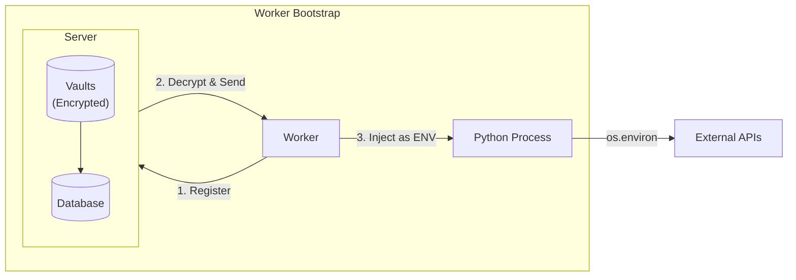

# Vaults: Secure Secret Management

Vaults provide secure, encrypted storage for secrets that workers need to access external services. Vault entries are automatically injected as environment variables when workers bootstrap.

## Overview



## Setup

### 1. Generate a Master Key

The vault master key is used to encrypt all vault entries. Generate a secure 256-bit key:

```bash
# Using OpenSSL
openssl rand -base64 32
```

Output:
```
YWJjZGVmZ2hpamtsbW5vcHFyc3R1dnd4eXoxMjM0NTY=
```

!!! danger "Keep This Secret"
    - Store the master key securely (e.g., in a secrets manager like AWS Secrets Manager, HashiCorp Vault, or Kubernetes Secrets)
    - Never commit the master key to version control
    - If the key is lost, all vault entries become unrecoverable
    - If the key is compromised, rotate all secrets stored in vaults

### 2. Configure the Server

Set the `RUNQY_VAULT_MASTER_KEY` environment variable:

=== "Environment Variable"

    ```bash
    export RUNQY_VAULT_MASTER_KEY="YWJjZGVmZ2hpamtsbW5vcHFyc3R1dnd4eXoxMjM0NTY="
    runqy serve
    ```

=== "Docker"

    ```yaml
    services:
      runqy-server:
        image: runqy/server:latest
        environment:
          - RUNQY_VAULT_MASTER_KEY=YWJjZGVmZ2hpamtsbW5vcHFyc3R1dnd4eXoxMjM0NTY=
    ```

=== "Kubernetes"

    ```yaml
    apiVersion: v1
    kind: Secret
    metadata:
      name: runqy-secrets
    type: Opaque
    data:
      vault-master-key: WVdKalpHVm1aMmhwYW10c2JXNXZjSEZ5YzNSMWRuZDRlWG94TWpNME5UWT0=
    ---
    apiVersion: apps/v1
    kind: Deployment
    spec:
      template:
        spec:
          containers:
            - name: server
              env:
                - name: RUNQY_VAULT_MASTER_KEY
                  valueFrom:
                    secretKeyRef:
                      name: runqy-secrets
                      key: vault-master-key
    ```

If `RUNQY_VAULT_MASTER_KEY` is not set, the server starts with vaults disabled. Vault API endpoints return `503 Service Unavailable`.

## Managing Vaults

### Create a Vault

Vaults are named collections of key-value pairs:

```bash
runqy vault create api-keys -d "API keys for external services"
runqy vault create model-credentials -d "ML model access tokens"
```

### Add Secrets

```bash
# Add API keys
runqy vault set api-keys OPENAI_API_KEY sk-proj-xxx
runqy vault set api-keys ANTHROPIC_API_KEY sk-ant-xxx
runqy vault set api-keys HF_TOKEN hf_xxx

# Add database credentials
runqy vault set model-credentials DB_PASSWORD supersecret123
```

By default, all entries are marked as secrets and their values are masked in API responses and CLI output.

### Add Non-Secret Values

For configuration values that don't need masking:

```bash
runqy vault set api-keys DEBUG_MODE true --no-secret
runqy vault set api-keys LOG_LEVEL info --no-secret
```

### View Vault Contents

```bash
runqy vault show api-keys
```

Output:
```
Vault: api-keys
Description: API keys for external services
Created: 2024-01-15T10:30:00Z
Updated: 2024-01-15T14:22:00Z

Entries (4):
KEY              VALUE           SECRET
OPENAI_API_KEY   sk****xx        yes
ANTHROPIC_API_KEY sk****xx       yes
HF_TOKEN         hf****xx        yes
DEBUG_MODE       true            no
```

### Get Decrypted Values

To retrieve the actual decrypted value (local mode only):

```bash
runqy vault get api-keys OPENAI_API_KEY
```

Output:
```
sk-proj-actual-key-value-here
```

!!! note
    `vault get` only works in local mode for security reasons.

### Remove Entries

```bash
runqy vault unset api-keys OLD_KEY
```

### Delete a Vault

```bash
runqy vault delete api-keys --force
```

## Using Vaults with Queues

### Configure Queue Deployment

Reference vaults in your queue configuration:

```yaml
queues:
  inference:
    priority: 6
    deployment:
      git_url: "https://github.com/example/inference.git"
      branch: "main"
      startup_cmd: "python main.py"
      startup_timeout_secs: 300
      vaults:
        - api-keys
        - model-credentials
```

When a worker registers for this queue, the server:

1. Retrieves all entries from the specified vaults
2. Decrypts the values
3. Sends them to the worker in the registration response
4. The worker injects them as environment variables

### Access in Python

```python
import os
from runqy_python import task, run

@task
def generate_text(payload, ctx):
    # Access vault entries as environment variables
    openai_key = os.environ.get("OPENAI_API_KEY")

    # Use the secrets
    from openai import OpenAI
    client = OpenAI(
        
        api_key=openai_key,
    )

    response = openai.ChatCompletion.create(
        model="gpt-4",
        messages=[{"role": "user", "content": payload["prompt"]}]
    )

    return {"text": response.choices[0].message.content}

if __name__ == "__main__":
    run()
```

## Multiple Vaults

When multiple vaults are specified, entries are merged. If the same key exists in multiple vaults, later vaults override earlier ones:

```yaml
deployment:
  vaults:
    - shared-secrets    # Applied first
    - project-secrets   # Overrides shared-secrets if keys conflict
```

## Security Best Practices

### 1. Use Separate Vaults for Different Concerns

```bash
runqy vault create shared-infrastructure -d "Shared infra credentials"
runqy vault create project-a-secrets -d "Project A specific secrets"
runqy vault create project-b-secrets -d "Project B specific secrets"
```

### 2. Limit Vault Access per Queue

Only reference the vaults a queue actually needs:

```yaml
queues:
  project-a:
    deployment:
      vaults:
        - shared-infrastructure
        - project-a-secrets  # Only project A secrets

  project-b:
    deployment:
      vaults:
        - shared-infrastructure
        - project-b-secrets  # Only project B secrets
```

### 3. Rotate Secrets Regularly

```bash
# Update a secret
runqy vault set api-keys OPENAI_API_KEY sk-new-key-value

# Workers receive the new value on next bootstrap/restart
```

### 4. Audit Vault Usage

Check which queues reference a vault before modifying:

```bash
runqy config list
# Review the deployment.vaults field for each queue
```

### 5. Secure the Master Key

- Store in a dedicated secrets manager
- Use different keys for different environments (dev, staging, prod)
- Implement key rotation procedures
- Monitor access to the master key

## Encryption Details

Vaults use AES-256-GCM encryption:

- **Algorithm**: AES-256 in GCM mode
- **Key**: 256-bit key derived from `RUNQY_VAULT_MASTER_KEY`
- **Nonce**: Random 12-byte nonce per encryption
- **Storage**: Encrypted ciphertext stored as binary blob in database

The encryption ensures:

- **Confidentiality**: Values cannot be read without the master key
- **Integrity**: Tampering with encrypted data is detected
- **Authenticity**: Only the holder of the master key can encrypt/decrypt

## Troubleshooting

### "vaults not configured" Error

The server returns `503 Service Unavailable` with message "vaults not configured".

**Cause**: `RUNQY_VAULT_MASTER_KEY` environment variable is not set or invalid.

**Solution**: Set a valid base64-encoded 32-byte key.

### "vault not found" Error

**Cause**: The vault name doesn't exist.

**Solution**: Create the vault first with `runqy vault create`.

### Workers Not Receiving Secrets

**Possible causes**:

1. Vault names in queue config don't match actual vault names
2. Vaults are empty
3. Server's vault feature is disabled

**Debug steps**:

```bash
# Check vault exists and has entries
runqy vault show api-keys

# Check queue config references correct vaults
runqy config list

# Check server logs for vault-related warnings
```

### Key Rotation

To rotate the master key:

1. Export all vault entries (values will be decrypted)
2. Stop the server
3. Set new `RUNQY_VAULT_MASTER_KEY`
4. Re-import all vault entries (values will be re-encrypted with new key)
5. Restart workers to receive re-encrypted secrets

!!! warning
    There's no automatic key rotation. Plan for manual rotation if needed.
